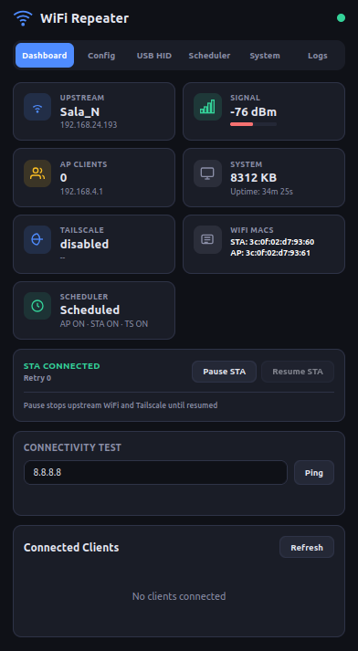
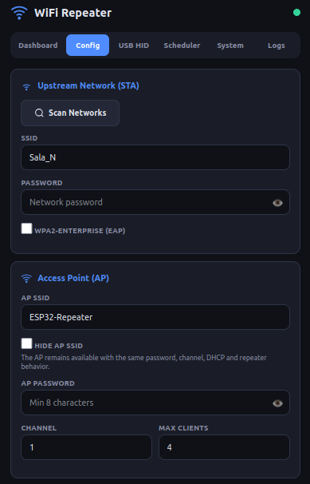
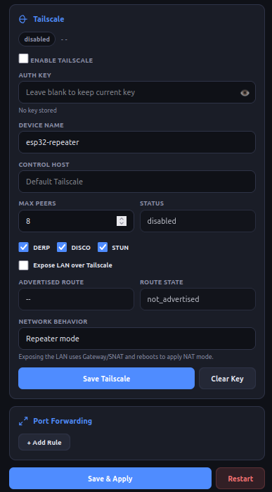
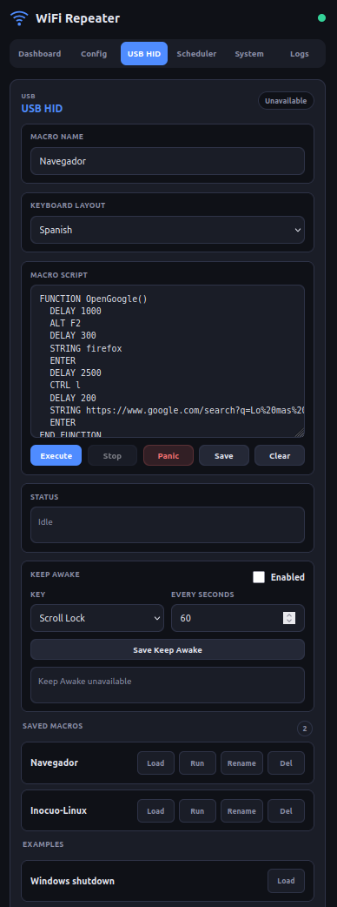
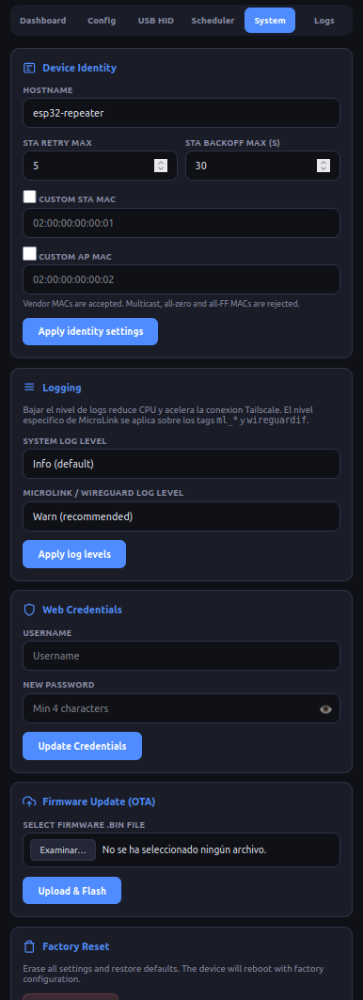

# ESP32-S3 Tailscale Marauder

WiFi Repeater based on **ESP32-S3** with **WPA2-Enterprise** support, embedded **Tailscale** client, and **USB HID DuckyScript** execution capabilities.

[🇪🇸 Versión en Español](README-ESP.md)

All configuration is done via an embedded responsive web UI served directly from the device.

<p align="center">
  <a href="img/screenshot1.png"></a>
  <a href="img/screenshot2.png"></a>
  <a href="img/screenshot3.png"></a>
  <a href="img/screenshot4.png"></a>
  <a href="img/screenshot5.png"></a>
  <a href="img/screenshot5.png"></a>
</p>

## Main Features

### 🎓 WPA2-Enterprise and WiFi Repeater
- **Simultaneous STA+AP** — Connects to a WiFi network (STA) and creates its own Access Point (AP).
- **WPA2-Enterprise** — Supports EAP-PEAP/TTLS (corporate/university networks like eduroam).
- **NAPT & Port Forwarding** — NAT for AP clients and port redirection.
- **Configurable Identity** — Custom Hostname and MAC addresses for STA/AP.

### 🛣️ Tailscale with Advertise Routes
- **Embedded Tailscale Client** — Native C/FreeRTOS integration using MicroLink.
- **Advertise Routes (Subnet Router)** — Advertises LAN routes and performs SNAT, allowing `Tailscale -> LAN` access.
- **Noise IK Authentication** — Secure handshake with Tailscale servers.
- **DERP Relay Support** — Connectivity even behind restrictive firewalls.

### ⌨️ USB HID Executor (DuckyScript)
- **DuckyScript Parser** — Parser support for the command set listed below.
- **Real HID Output** — Execution of keystrokes plus runtime variables, expressions, branching, loops, functions, default delays, and jitter.
- **Dry-Run Mode** — Used automatically when TinyUSB HID is unavailable; hardware/USB-mode commands remain validation-only and are skipped in dry-run.
- **Macro Storage** — Save up to 12 custom macros in non-volatile memory.
- **Keep Awake Key Pulse** — Optional periodic USB HID key pulse to reduce host lock-screen activation. The user selects the key and interval; it pauses while any macro is queued or running.
- **Multi-layout Support** — Support for ES, US, UK, LATAM, FR, DE, IT, PT, BR, Nordic, BE, TR, PL, CZ, SK, HU, RO, HR, SR, SL, BG, RU, UA, ZH, and TW layouts.

### 📅 Smart Scheduler
- **Time-based Rules** — Schedule when AP, STA, or Tailscale should be active.
- **Scheduled USB HID Macros** — In `Scheduled` mode, each rule can optionally run one saved USB HID macro once when the rule becomes active.
- **NTP Sync** — Automatic time synchronization for precise execution.

### 💻 Web UI
- **Responsive UI** — Mobile-first design.
- **OTA Updates** — Web-based firmware updates.
- **Log Viewer** — Real-time system logs.

## Supported DuckyScript Commands

The following commands are supported for **real HID/runtime execution** when the USB HID device is ready:

| Command | Function | Example |
|---|---|---|
| `REM`, `//`, `END_REM` | Comments | `REM Comment` |
| `STRING`, `STRINGLN` | Type text, with `$VAR` and `#DEFINE` interpolation | `STRINGLN Hello $NAME` |
| `DELAY` | Wait in ms or expression result | `DELAY RANDOM_INT(200,800)` |
| `DEFAULT_DELAY`, `DEFAULTDELAY` | Add delay after physical commands | `DEFAULT_DELAY 50` |
| `JITTER` | Add random delay variation | `JITTER 25` |
| `VAR`, `DEFINE` | Runtime variables and defines | `VAR $N = RANDOM_INT(1,5)` |
| `IF`, `ELSE`, `END_IF` | Conditional execution | `IF $N > 2 THEN` |
| `WHILE`, `END_WHILE`, `BREAK`, `CONTINUE` | Runtime loops | `WHILE $N < 5` |
| `LOOP` | Restart payload, optionally counted | `LOOP 3` |
| `FUNCTION`, `END_FUNCTION`, `RETURN`, `NAME()` | Simple function calls | `OpenRun()` |
| `ENTER`, `TAB`, `ESCAPE`, `SPACE` | Standard keys | `ENTER` |
| `BACKSPACE`, `DELETE`, `INSERT` | Edit keys | `BACKSPACE` |
| `HOME`, `END`, `PAGEUP`, `PAGEDOWN`| Navigation keys | `HOME` |
| `UPARROW`, `DOWNARROW`, `LEFTARROW`, `RIGHTARROW` | Arrow keys | `UPARROW` |
| `UP`, `DOWN`, `LEFT`, `RIGHT`, `ESC`, `CONTROL`, `OPTION` | Runtime aliases | `ESC` |
| `PRINTSCREEN`, `PAUSE`, `CAPSLOCK`, `NUMLOCK`, `SCROLLLOCK`, `MENU` | Extra keyboard keys | `SCROLLLOCK` |
| `CTRL`, `ALT`, `SHIFT`, `GUI`, `WINDOWS`, `COMMAND` | Modifiers / combos | `CTRL ALT DELETE` |
| `F1`–`F12` | Function keys | `F5` |
| `HOLD` / `RELEASE` | Persistent modifiers | `HOLD CTRL` |
| `STOP_PAYLOAD` | Stop current script | `STOP_PAYLOAD` |

The following commands are recognized for parser compatibility, but are intentionally **disabled at runtime / skipped / validation-only**:
`ATTACKMODE`, `SAVE_ATTACKMODE`, `RESTORE_ATTACKMODE`, `WAIT_FOR_BUTTON_PRESS`, `LED`, `EXFIL`, `INJECT_MOD`, and `RESTART_PAYLOAD`.

USB HID **Keep Awake** is configured separately from DuckyScript macros. It can periodically send `SCROLLLOCK`, `PAUSE`/`BREAK`, `CAPSLOCK`, `NUMLOCK`, `PRINTSCREEN`, `MENU`, or `F1`-`F12` every 5-3600 seconds. When a macro is queued or running, Keep Awake pauses automatically and resumes on the next interval if still enabled.

Recognized internal variables are `$_CAPSLOCK_ON`, `$_NUMLOCK_ON`, `$_SCROLLLOCK_ON`, `$_CURRENT_VID`, `$_CURRENT_PID`, `$_BUTTON_ENABLED`, and `$_HOST_CONFIGURATION_REQUEST_COUNT`. Current HID runtime resolves the lock-key states and button placeholder; VID/PID are parser-recognized but not resolved by the executor yet.

## Hardware: ESP32-S3 N16R8 (Required)

## Scheduler Usage

The **Scheduler** tab controls time-based automation. It only applies rules when
the operating mode is set to **Scheduled**; in **Always on** mode, saved rules are
kept but not executed.

1. Open the **Scheduler** tab.
2. Confirm the timezone and press **Sync now** if the device time is not synced.
3. Select **Scheduled** in **Operating Mode**.
4. Press **Add rule** and configure:
   - days of the week,
   - start and end time,
   - AP / STA / Tailscale enabled states,
   - optional saved **USB HID Macro**.
5. Press **Apply scheduler**.

Scheduler rules are weekly rules, not one-shot timers. A rule selected for
Tuesday will run every Tuesday until changed or disabled.

When a rule has a USB HID macro selected, the macro runs **once when that rule
becomes active**. It does not repeat continuously during the active window. If
the device boots or the scheduler config is applied while already inside an
active rule window, the macro is also queued once for that active window.

Use **No macro** when a rule should only control AP / STA / Tailscale state.

## REST API

All API endpoints require **HTTP Basic Auth** (default: `admin`/`admin`).

| Category | Method | Endpoint | Description |
|---|---|---|---|
| **System** | `GET` | `/api/status` | Global system status summary |
| | `GET` | `/api/logs` | Raw system logs (text/plain) |
| | `POST` | `/api/restart` | Reboot the device |
| | `POST` | `/api/ota` | Firmware update (binary payload) |
| | `POST` | `/api/factory-reset` | Erase config and reboot |
| **WiFi** | `GET` | `/api/wifi/state` | Detailed Station (STA) state |
| | `POST` | `/api/wifi/pause` | Pause STA reconnection |
| | `POST` | `/api/wifi/resume` | Resume STA reconnection |
| | `GET` | `/api/scan` | Scan for nearby WiFi networks |
| | `GET` | `/api/clients` | List connected clients on AP |
| | `POST` | `/api/ping` | Ping a target host |
| **Tailscale** | `GET` | `/api/tailscale/status` | Tailscale client status |
| | `GET` | `/api/tailscale/config` | Get current Tailscale config |
| | `POST` | `/api/tailscale/config` | Update Tailscale config |
| **USB HID** | `GET` | `/api/usb-hid/status` | Current executor status |
| | `GET` | `/api/usb-hid/macros` | List all saved macros |
| | `POST` | `/api/usb-hid/macros` | Create a new macro |
| | `GET` | `/api/usb-hid/macros/{id}` | Get specific macro details |
| | `PUT` | `/api/usb-hid/macros/{id}` | Update existing macro |
| | `DELETE`| `/api/usb-hid/macros/{id}` | Delete a macro |
| | `POST` | `/api/usb-hid/validate` | Validate DuckyScript syntax |
| | `POST` | `/api/usb-hid/execute` | Run script (Dry-run or HID) |
| | `POST` | `/api/usb-hid/stop` | Gracefully stop execution |
| | `POST` | `/api/usb-hid/panic` | Emergency stop & release keys |
| | `GET` | `/api/usb-hid/keepalive` | Get Keep Awake state and counters |
| | `POST` | `/api/usb-hid/keepalive` | Configure periodic Keep Awake key and interval |
| **Scheduler**| `GET` | `/api/scheduler/status` | Scheduler state & next event |
| | `GET` | `/api/scheduler/config` | Get scheduling rules, including optional `usb_hid_macro_id` per rule |
| | `POST` | `/api/scheduler/config` | Update scheduling rules and validate scheduled macro IDs |
| | `POST` | `/api/scheduler/sync` | Force NTP time sync |
| **Config** | `GET` | `/api/config` | Get global device config |
| | `POST` | `/api/config` | Update global device config |
| | `POST` | `/api/loglevel` | Change log levels at runtime |
| | `POST` | `/api/auth/change` | Change Web UI credentials |
| | `GET` | `/api/auth/check` | Verify current credentials |

## Pre-compiled Binaries (Easy Install)

Pre-built binaries are available in the `firmware/` directory. You can flash them directly to your ESP32-S3 via USB without building from source.

### Initial Flash (via USB)

1. Connect your ESP32-S3 to your computer.
2. Ensure you have `esptool.py` installed (`pip install esptool`).
3. Run the following command (replace `/dev/ttyACM0` with your actual port, e.g., `COM3` on Windows):

```bash
esptool.py -p /dev/ttyACM0 -b 460800 --before default_reset --after hard_reset --chip esp32s3 \
  write_flash --flash_mode dio --flash_size 16MB --flash_freq 80m \
  0x0 firmware/bootloader.bin \
  0x8000 firmware/partition-table.bin \
  0xf000 firmware/ota_data_initial.bin \
  0x20000 firmware/wifi_repeater.bin
```

### Subsequent Updates (Web OTA)

Once the firmware is running, you don't need cables anymore!
1. Access the Web UI (default IP `192.168.4.1` or the IP assigned by your network).
2. Go to the **System** tab.
3. Upload the new `wifi_repeater.bin` file in the **OTA Update** section.

## Build from Source

### Requirements

- **ESP-IDF v6.1-dev** or higher ([Installation guide](https://docs.espressif.com/projects/esp-idf/en/stable/esp32/get-started/))

### Build

```bash
idf.py set-target esp32s3
idf.py build
```

### Flash

```bash
idf.py -p /dev/ttyACM0 flash
```

---

## ⚠️ Disclaimer

This tool is for **educational and ethical testing purposes only**. The use of this software for attacking targets without prior mutual consent is illegal. It is the end user's responsibility to obey all applicable local, state, and federal laws. The developers assume no liability and are not responsible for any misuse or damage caused by this program.

## 📄 License

This project is licensed under the **MIT License**. See the [LICENSE](LICENSE) file for details.

Copyright (c) 2026 soyunomas
